# MovieRecorders :: 영화 추천 사이트

**01150813** 

<div align="center">

  
https://movierecorders-22092.web.app/
</div>


<p align="center">
  
  
  
  
  
  
</p>

<p align="center">
"We record your film life. We support your film life."
</p>


## 목차

1. [MovieRecorders 란?](https://github.com/LifeRecorders/)
2. [팀원 정보 및 업무 분담 내역]([https://github.com/LifeRecorders/1126/blob/master/README.md#%ED%8C%80%EC%9B%90-%EC%A0%95%EB%B3%B4-%EB%B0%8F-%EC%97%85%EB%AC%B4-%EB%B6%84%EB%8B%B4-%EB%82%B4%EC%97%AD](https://github.com/LifeRecorders/1126/blob/master/README.md#팀원-정보-및-업무-분담-내역))
3. [목표 서비스 구현 및 실제 구현 정도]([https://github.com/LifeRecorders/1126/blob/master/README.md#%EB%AA%A9%ED%91%9C-%EC%84%9C%EB%B9%84%EC%8A%A4-%EA%B5%AC%ED%98%84-%EB%B0%8F-%EC%8B%A4%EC%A0%9C-%EA%B5%AC%ED%98%84-%EC%A0%95%EB%8F%84](https://github.com/LifeRecorders/1126/blob/master/README.md#목표-서비스-구현-및-실제-구현-정도))
   - 일자별 업무 진행
     - 프로젝트 관리 :: Notion
     - 코드 관리 :: Github
4. [데이터베이스 모델링(ERD)]([https://github.com/LifeRecorders/1126/blob/master/README.md#%EB%8D%B0%EC%9D%B4%ED%84%B0%EB%B2%A0%EC%9D%B4%EC%8A%A4-%EB%AA%A8%EB%8D%B8%EB%A7%81erd](https://github.com/LifeRecorders/1126/blob/master/README.md#데이터베이스-모델링erd))
8. [핵심 기능]([https://github.com/LifeRecorders/1126/blob/master/README.md#%ED%95%B5%EC%8B%AC-%EA%B8%B0%EB%8A%A5](https://github.com/LifeRecorders/1126/blob/master/README.md#핵심-기능))
9. [배포 서버 URL]([https://github.com/LifeRecorders/1126/blob/master/README.md#%EB%B0%B0%ED%8F%AC-%EC%84%9C%EB%B2%84-url](https://github.com/LifeRecorders/1126/blob/master/README.md#배포-서버-url))
   - Heroku 서버
10. [기타 (느낀점)]([https://github.com/LifeRecorders/1126/blob/master/README.md#%EA%B8%B0%ED%83%80%EB%8A%90%EB%82%80%EC%A0%90](https://github.com/LifeRecorders/1126/blob/master/README.md#기타느낀점))
11. [부록]([https://github.com/LifeRecorders/1126/blob/master/README.md#%EB%B6%80%EB%A1%9D](https://github.com/LifeRecorders/1126/blob/master/README.md#부록))
    - 로컬 실행 방법
    - 개인정보처리방침


## MovieRecorders 란?

LifeRecorders 팀은 문화를 향유하는 당신의 삶을 언제나 지지합니다. 더욱 풍부한 문화를 향유의 삶을 위해 기존 영화 추천 사이트와 차별화된 영화 일기를 작성할 수 있는 기능을 구현하였습니다. 

문의사항이 있으실 경우 아래의  e-mail로 연락 바랍니다.

---


<p align="center">
makeartweek@gmail.com
</p>


## 팀원 정보 및 업무 분담 내역

#### **Backend**

 

[**정승원**](https://github.com/tesschung): DB / 장고 REST API 설계, 장고 로직 구현, 데이터 스크래핑


#### **Frontend**

  

[**이인동**](https://github.com/IndongLee): 화면 설계 및 디자인, Vue 로직 구현, REST API 활용


## 목표 서비스 구현 및 실제 구현 정도

#### Django REST API 서버(djangorestframework)
#### Backend

- Django : 2.1
- Django REST framework : 3.9.4
- Python : 3.7.4


#### VueJS (Node, SFC) 
#### Frontend

- Vue : 2.6.10
- Axios : 0.18.0
- Bulma : 0.7.4
- Font Awesome : 5.8.2


#### API

- Youtube API
- 영화진흥원 API
- 네이버 영화 검색 API


### 일자별 업무 진행

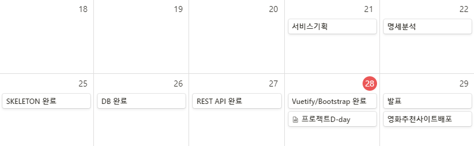

- 진행 기간 : 2019.11.21 - 2019.11.30
- 목표 : 영화 기록 중심의 영화 정보 포털 사이트 구현


### 📝 프로젝트 관리 :: Notion

- 담당자별 업무 분담 히스토리 팔로업

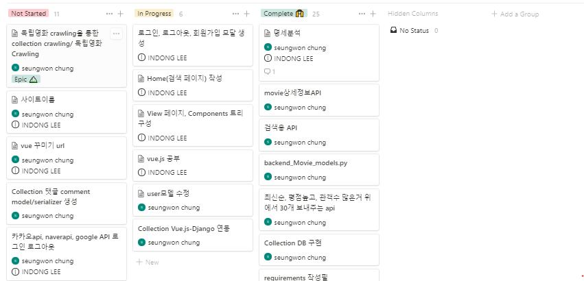

- 문서 실시간 관리

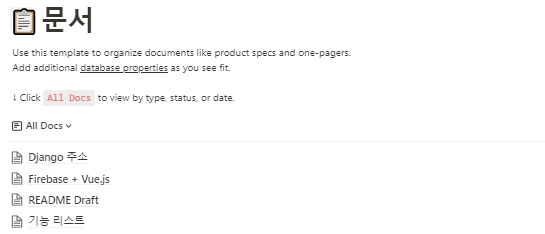


### 💻 코드 관리 :: Github 

모든 collaborators가 fork를 하여 서로의 코드를 리뷰한 후 확인 및 승인한다.

이와 관련한 [워크 플로우](https://github.com/orgs/LifeRecorders/dashboard)는 아래에서 확인 가능합니다.

- https://github.com/orgs/LifeRecorders/dashboard


## 데이터베이스 모델링(ERD)


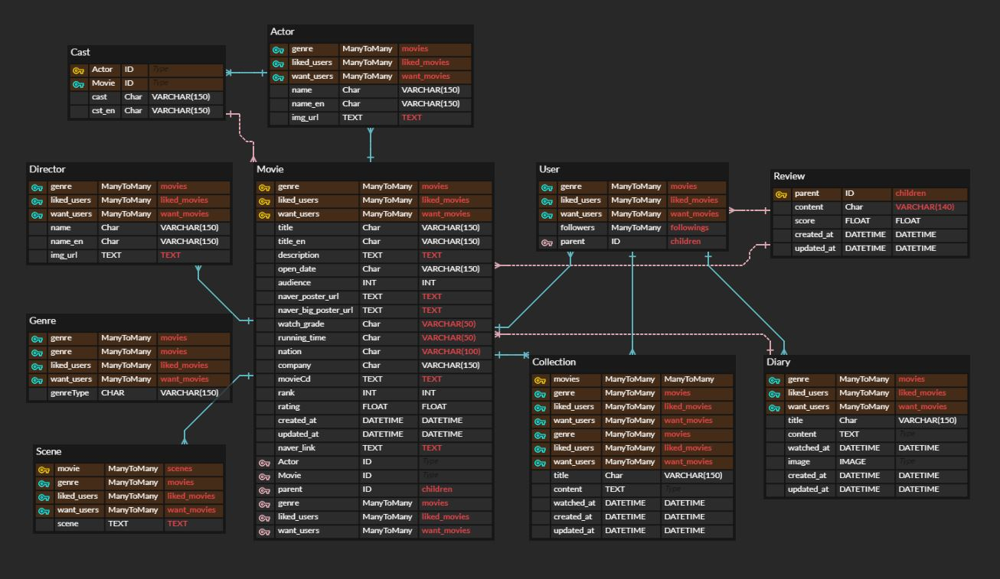


- 기능별 application을 구현하여 개별 application은 독립적인 Model을 갖게 하였습니다. 이를 통하여 코드관리를 편리하게 하고, 충돌 요소를 최대한 제거할 수 있었습니다.


개별 application의 model
>accounts/ User

>diaries/ Diary, Collection
>

> movie/ Genre, Movie, Scene, Director, Actor, Cast, Review
>


### 데이터 스크래핑

- 최대한 깨끗한 영화 데이터를 얻기위해서 데이터 스크래핑시 수집-정제라는 큰 틀에서 총 6단계를 거치게 됩니다.
- `1 단계` 해당 단계에서 총 `5단계`로 데이터를 스크래핑합니다.
    - 영화진흥원 API - 주간 박스오피스
    - 영화진흥원 API - 영화목록
    - 영화진흥원 API - 영화상세
    - 네이버 API - 영화상세
    - 네이버 크롤링 - 영화상세
  - `2 단계`
    - 네이버 크롤링 - 영화 포스터
  - `3 단계`
    - 네이버 크롤링 - Actor의 빈데이터 수정
  - `4 단계`
    - 네이버 크롤링 - Director의 빈데이터 수정
  - `5 단계`
    - 다음 크롤링 - Scene 데이터 추가
  - `6 단계`
    - 불필요한 데이터 모두 정제

> 이러한 6단계를 통하여 데이터에 대한 위험요소를 최대한 줄이면서, 최대한 다양하고 많은 데이터를 스크래핑하였습니다. 이를 통하여 사용자는 풍부한 데이터에 대한 사용자 경험을 보장합니다.


## 핵심 기능

### 1) 영화 추천

- 메인 화면에서 관람객 수, 최신순, 주간 박스오피스순으로 BEST 영화 추천


- 메인 화면에서 평론가 추천의 영화 컬렉션 확인


### 2) 리뷰 작성

- 로그인 사용자는 ⭐️ 를 조작해 평점과 리뷰 등록

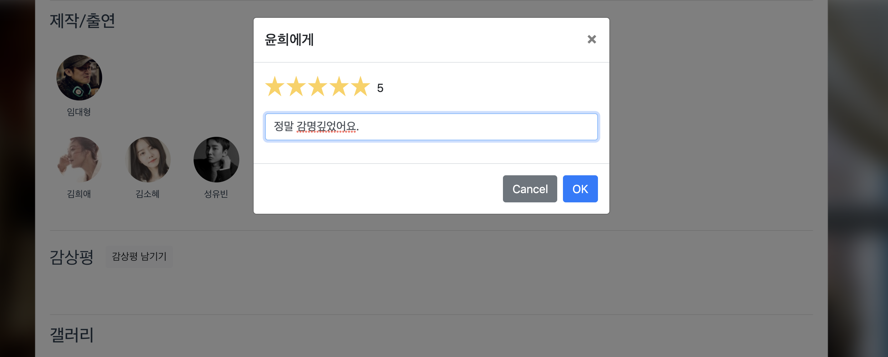

- 내가 남긴 리뷰 수정, 삭제 기능

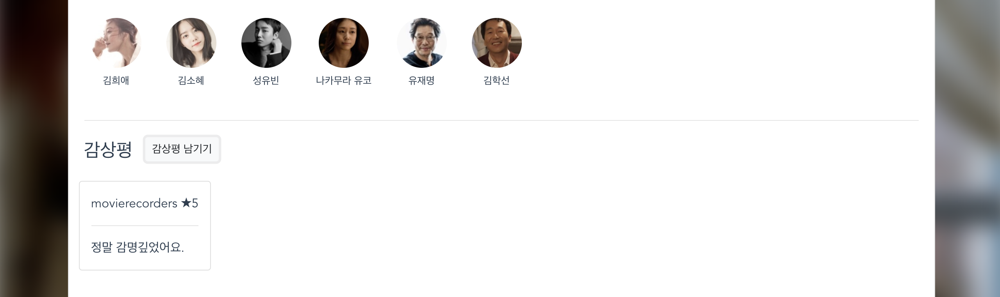


### 3) 영화 검색

- 직관적인 검색창


- 작품, 배우, 감독, 다른 사용자 중복 검색 기능

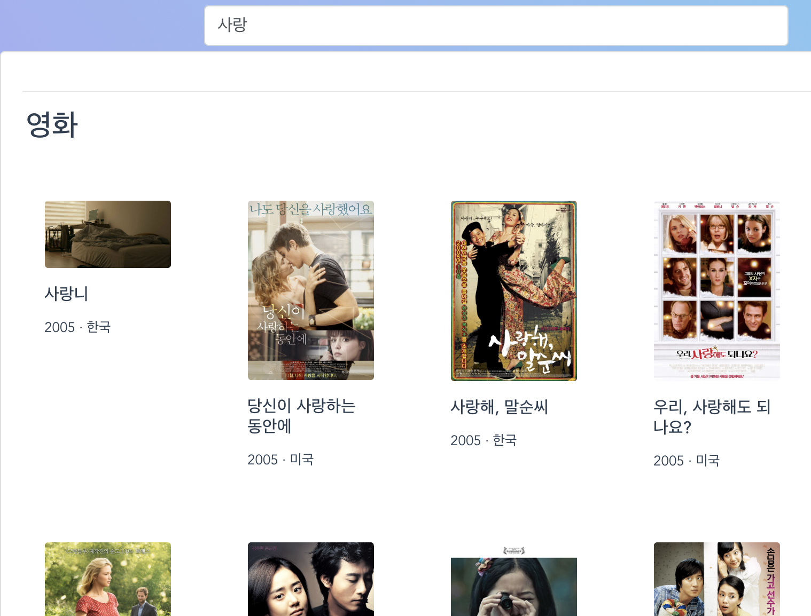

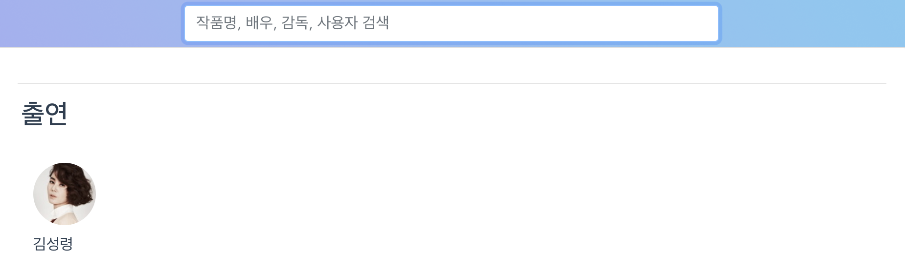

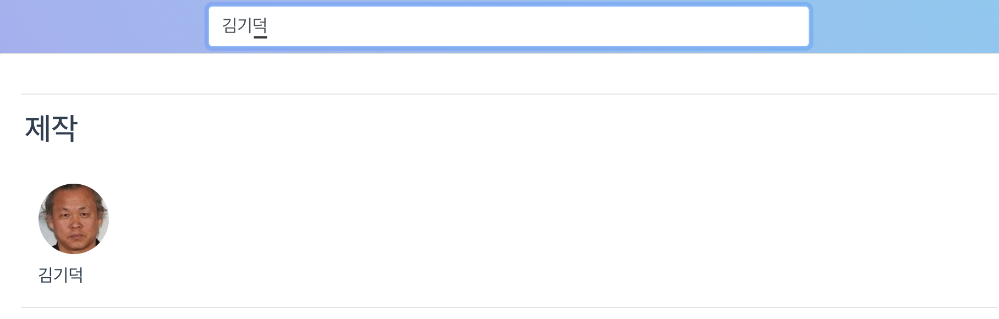

### 4) 사용자 프로필

- 내 팔로워들의 최애 영화 확인


### 5) 영화 상세정보 

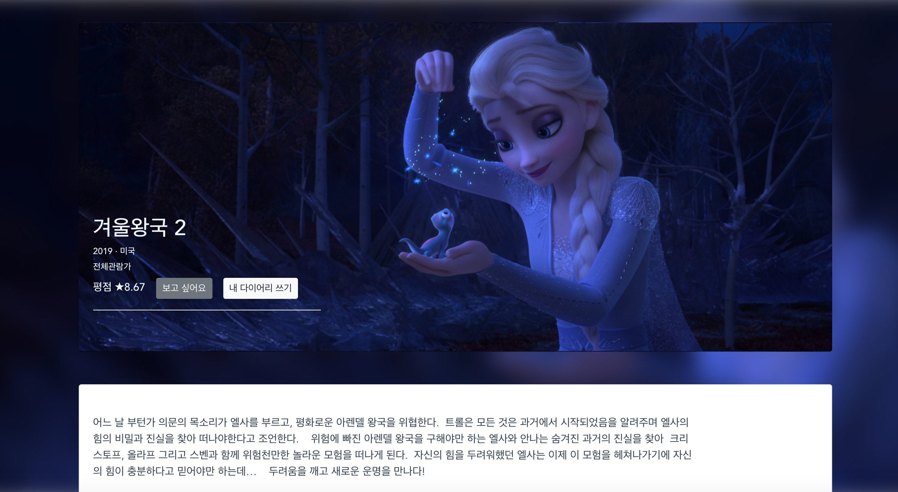

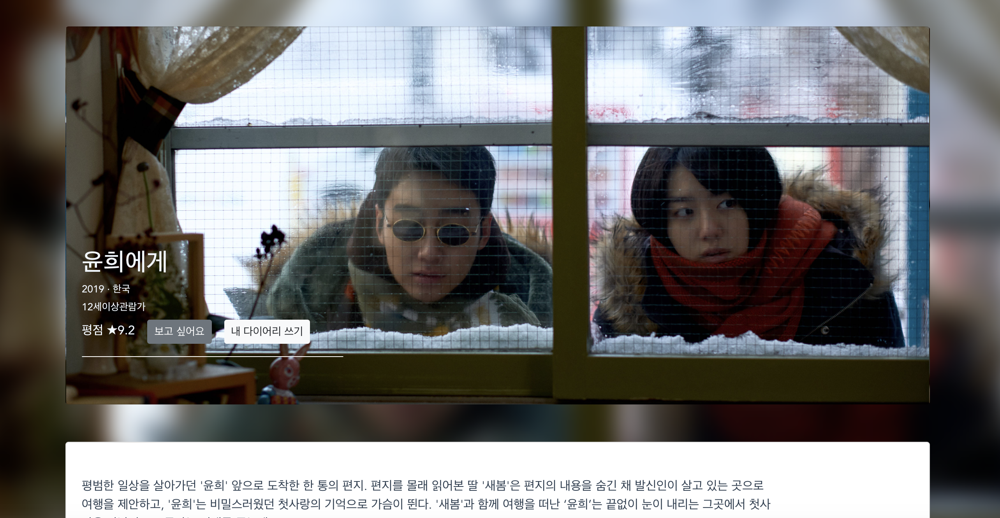

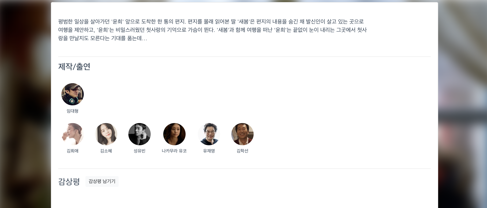

- 갤러리 사진 자동 넘김 및 사용자 임의 넘김 가능


### 6) 사용자 자신만의 영화 일기(Diary) 등록

- 달력 UI로 직관적인 날짜 선택과 함께 영화 일기를 보거나, 쓰거나, 수정하거나, 삭제 가능


### 7) 사용자의 영화 컬렉션(Collection) 등록

- 좋아하는 영화들을 모아서 컬렉션을 만들 수 있고, 만든 컬렉션은 다른 사용자들에게 메인화면에서 추천 가능


### 8) UI/UX

- Vuetify와 Bootstrap 프레임워크 이용으로 사용자에게 직관적인 UI/UX 제공
- Single Page App으로 페이지 리로드 최소화


## 배포 서버 URL

### 배포환경

서버 : Firebase

DB: Heroku 서버


## 기타(느낀점)

- 이론적으로 배운 내용을 토대로 직접 구현해보면서 더욱 심도있는 배움을 얻었다.
- 실 데이터를 스크래핑하는 과정에서 다양한 에러처리를 하는데 시간을 많이 쏟았는데, 시간을 쏟은 덕분에 정제된 데이터로 front에 데이터 전달할때 편했다.

- 기획-개발-테스트-개발-테스트-배포 라는 개발의 전 과정을 협업을 통해 이뤄내면서, 특정 서비스를 함께 구현해나가는 것이 보람찼다.

  

## 부록

### :computer: 로컬 실행 방법 

pip로 프로젝트에 필요한 패키지를 설치합니다.

```
> pip install -r requirements.txt
```

migrate를 한 뒤 Django 프로젝트를 실행합니다.

```
> python manage.py migrate
> python manage.py runserver
```

```
pip install djangorestframework-jwt
pip install djangorestframework
pip install django-cors-headers
pip install drf-yasg
pip install pillow
$ python manage.py dumpdata [app_name].[model.name] --indent [INDENT] > [fixture_name].json
```

```
$ python manage.py dumpdata movies.scene --indent 2 > scene-data.json
$ python manage.py dumpdata movies.director --indent 2 > director-data.json
$ python manage.py dumpdata movies.actor --indent 2 > actor-data.json
```


### :information_source: [개인정보처리방침](https://github.com/makeartweek/bixby/tree/master/Privacy-policy) 

<div align="center">

</div>

"from `LifeRecorders` import `inspiration`"
