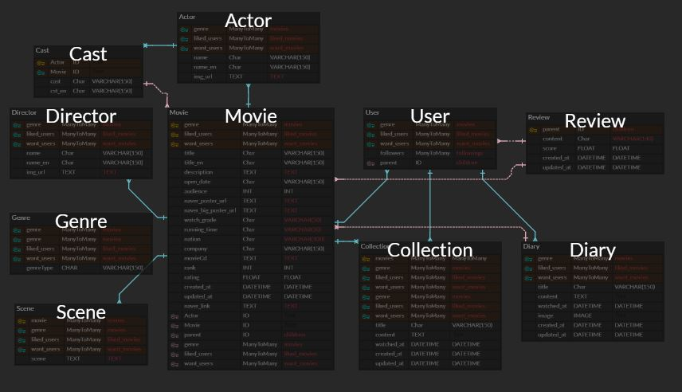

# <movie프로젝트이름>

**01150813** 

<div align="center">

</div>


<p align="center">
  
  
  
  
  
  
</p>

<p align="center">
"We record your film life."
</p>


## 목차

1. [<movie프로젝트이름>란?](https://github.com/LifeRecorders/)
2. [팀원 정보 및 업무 분담 내역](https://github.com/LifeRecorders/)
3. [목표 서비스 구현 및 실제 구현 정도](https://github.com/LifeRecorders/)
   - 일자별 업무 진행
4. [데이터베이스 모델링(ERD)](https://github.com/LifeRecorders/)
8. [핵심 기능](https://github.com/LifeRecorders/)
9. [배포 서버 URL](https://github.com/LifeRecorders/)
   - Heroku 서버
10. [기타 (느낀점)](https://github.com/LifeRecorders/)
11. [부록](https://github.com/LifeRecorders/)
    - 로컬 실행 방법


## <movie프로젝트이름>란?

LifeRecorders 팀은 문화를 향유하는 당신의 삶을 언제나 지지합니다. 더욱 풍부한 문화를 향유의 삶을 위해 기존 영화 추천 사이트와 차별화된 영화 일기를 작성할 수 있는 기능을 구현하였습니다. 

문의사항이 있으실 경우 아래의  e-mail로 연락 바랍니다.

---


<p align="center">
makeartweek@gmail.com
</p>


## 팀원 정보 및 업무 분담 내역

#### **Backend**

 

[**정승원**](https://github.com/tesschung): DB / 장고 REST API 설계, 장고 로직 구현, 데이터 스크래핑


#### **Frontend**

  

[**이인동**](https://github.com/IndongLee): 화면 설계 및 디자인, Vue 로직 구현, REST API 활용


## 목표 서비스 구현 및 실제 구현 정도

#### Django REST API 서버(djangorestframework)
#### Backend

- Django : 2.1
- Django REST framework : 3.9.4
- Python : 3.7.4


#### VueJS (Node, SFC) 
#### Frontend

- Vue : 2.6.10
- Axios : 0.18.0
- Bulma : 0.7.4
- Font Awesome : 5.8.2


#### API

- Youtube API
- 영화진흥원 API
- 네이버 영화 검색 API


### 일자별 업무 진행


- 진행 기간 : 2019.11.21 - 2019.11.30
- 목표 : 영화 기록 중심의 영화 정보 포털 사이트 구현


### 📝 프로젝트 관리 :: Notion

- 담당자별 업무 분담 히스토리 팔로업


- 문서 실시간 관리


### 💻 코드 관리 :: Github 

모든 collaborators가 fork를 하여 서로의 코드를 리뷰한 후 확인 및 승인한다.

이와 관련한 [워크 플로우](https://github.com/orgs/LifeRecorders/dashboard)는 아래에서 확인 가능합니다.

- https://github.com/orgs/LifeRecorders/dashboard


## 데이터베이스 모델링(ERD)





- 기능별 application을 구현하여 개별 application은 독립적인 Model을 갖게 하였습니다. 이를 통하여 코드관리를 편리하게 하고, 충돌 요소를 최대한 제거할 수 있었습니다.


개별 application의 model
>accounts/ User

>diaries/ Diary, Collection
>

> movie/ Genre, Movie, Scene, Director, Actor, Cast, Review
>


### 데이터 스크래핑

- 최대한 깨끗한 영화 데이터를 얻기위해서 데이터 스크래핑시 수집-정제라는 큰 틀에서 총 6단계를 거치게 됩니다.
- `1 단계` 해당 단계에서 총 `5단계`로 데이터를 스크래핑합니다.
    - 영화진흥원 API - 주간 박스오피스
    - 영화진흥원 API - 영화목록
    - 영화진흥원 API - 영화상세
    - 네이버 API - 영화상세
    - 네이버 크롤링 - 영화상세
  - `2 단계`
    - 네이버 크롤링 - 영화 포스터
  - `3 단계`
    - 네이버 크롤링 - Actor의 빈데이터 수정
  - `4 단계`
    - 네이버 크롤링 - Director의 빈데이터 수정
  - `5 단계`
    - 다음 크롤링 - Scene 데이터 추가
  - `6 단계`
    - 불필요한 데이터 모두 정제

> 이러한 6단계를 통하여 데이터에 대한 위험요소를 최대한 줄이면서, 최대한 다양하고 많은 데이터를 스크래핑하였습니다. 이를 통하여 사용자는 풍부한 데이터에 대한 사용자 경험을 보장합니다.


## 핵심 기능

### 1) 영화 추천

- 메인 화면에서 관람객 수, 최신순, 주간 박스오피스순으로 BEST 영화 추천

- 메인 화면에서 평론가 추천의 영화 컬렉션 확인


### 2) 리뷰 작성

- 로그인 유저는 ⭐️ 를 조작해 평점과 리뷰 등록
- 내가 남긴 리뷰 수정, 삭제 기능


### 3) 영화 검색

- 다른 사용자 검색

- 작품으로 검색
- 배우로 검색
- 감독으로 검색


### 4) 유저 프로필

- 내 팔로워들의 최애 영화 확인


### 5) 유저 자신만의 영화 일기(Diary) 등록

- 


### 6) 유저의 영화 컬렉션(Collection) 등록

- 


### 10) UI/UX

- Vuetify와 Bootstrap 프레임워크 이용으로 사용자에게 직관적인 UI/UX 제공
- Single Page App으로 페이지 리로드 최소화


## 배포 서버 URL

### 배포환경

서버 : Firebase

DB: Heroku 서버


## 기타(느낀점)

- 이론적으로 배운 내용을 토대로 직접 구현해보면서 더욱 심도있는 배움을 얻었다.
- 실 데이터를 스크래핑하는 과정에서 다양한 에러처리를 하는데 시간을 많이 쏟았는데, 시간을 쏟은 덕분에 정제된 데이터로 front에 데이터 전달할때 편했다.

- 기획-개발-테스트-개발-테스트-배포 라는 개발의 전 과정을 협업을 통해 이뤄내면서, 특정 서비스를 함께 구현해나가는 것이 보람찼다.

  

## 부록

### :computer: 로컬 실행 방법 

pip로 프로젝트에 필요한 패키지를 설치합니다.

```
> pip install -r requirements.txt
```

migrate를 한 뒤 Django 프로젝트를 실행합니다.

```
> python manage.py migrate
> python manage.py runserver
```

```
pip install djangorestframework-jwt
pip install djangorestframework
pip install django-cors-headers
pip install drf-yasg
pip install pillow
$ python manage.py dumpdata [app_name].[model.name] --indent [INDENT] > [fixture_name].json
```

```
$ python manage.py dumpdata movies.scene --indent 2 > scene-data.json
$ python manage.py dumpdata movies.director --indent 2 > director-data.json
$ python manage.py dumpdata movies.actor --indent 2 > actor-data.json
```


### :information_source: [개인정보처리방침](https://github.com/makeartweek/bixby/tree/master/Privacy-policy) 

<div align="center">

</div>
"from `LifeRecorders` import `inspiration`"


/movie/bi/pi/mediaView.nhn?code=189053&mid=

44240